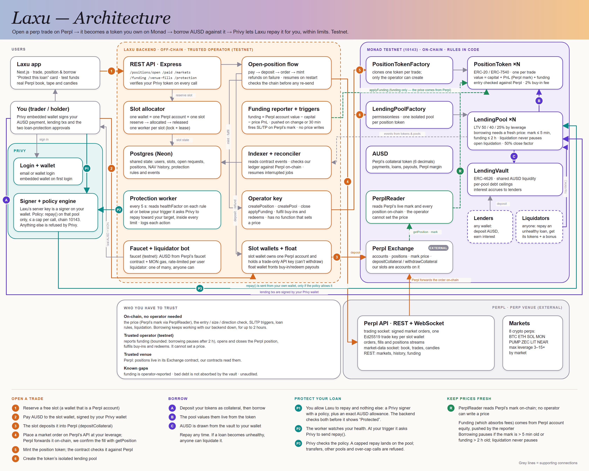

# Laxu: Make your position capital efficient.

Borrow against your open perp trade while it keeps running.

Monad testnet (chain 10143) · trading on Perpl · Privy wallets and loan protection · 3-min demo video: ⚠ TODO (video URL) · live app: ⚠ TODO (hosted URL; until then, [run it locally](#run-it-locally)) · [litepaper](docs/LITEPAPER.pdf) ([Markdown](docs/LITEPAPER.md))

> Testnet only, no real funds. Laxu is an independent project built on Perpl, not affiliated with or endorsed by Perpl, Monad or Privy. The contracts are unaudited.

## TL;DR

- **Problem:** a trader with an open, winning perp position on Perpl can only get cash out by closing it or pulling margin, which raises its leverage.
- **What Laxu does:** turns each open Perpl trade into its own token on Monad with an isolated lending pool, so the holder can borrow AUSD against the trade's live value.
- **Loan protection:** Laxu can repay part of a loan from the borrower's own wallet when its health falls to a level they chose, through a Privy signer whose policy allows `repay` on that one pool and nothing else. ([how it uses Privy](docs/PRIVY.md))
- **In 5 minutes a judge can:** get test funds, open a 3× long on ETH or BTC, borrow against it, repay and withdraw ([steps](#try-it-yourself-for-judges)).
- **The Monad parts:** six Laxu contracts plus one token clone and one pool clone per trade; the token reads Perpl's mark price from Perpl's exchange contract on every valuation ([details](#how-laxu-uses-monad)).

## Contents

1. [The problem, and who has it](#the-problem-and-who-has-it)
2. [How Laxu works](#how-laxu-works)
3. [How Laxu uses Monad](#how-laxu-uses-monad)
4. [How Laxu uses Privy](#how-laxu-uses-privy)
5. [Perpl](#perpl)
6. [Where this codebase started](#where-this-codebase-started)
7. [Try it yourself (for judges)](#try-it-yourself-for-judges)
8. [What works / what doesn't work yet](#what-works--what-doesnt-work-yet)
9. [Key decisions and tradeoffs](#key-decisions-and-tradeoffs)
10. [Code tour](#code-tour)
11. [Tests: the risky path](#tests-the-risky-path)
12. [Edge cases handled](#edge-cases-handled)
13. [Deployed contracts](#deployed-contracts)
14. [Tech stack and credits](#tech-stack-and-credits)
15. [How this was built](#how-this-was-built)
16. [Run it locally](#run-it-locally)
17. [Roadmap](#roadmap)
18. [Acknowledgments and license](#acknowledgments-and-license)

## The problem, and who has it

**Intended user:** perp traders on Perpl, the perpetual futures exchange on Monad. Its testnet lists eight markets: BTC, ETH, SOL, PUMP, MON, ZEC, LIT and NEAR.

**What they do today.** A trader with an open, profitable position who needs cash can **close the trade**, giving up the exposure they wanted, or **withdraw margin**, which shrinks the cushion and raises the leverage. Either way, the value of the trade cannot be used while the trade stays as it is.

**Why nothing covers it:**

- perp venues do not lend against open positions;
- lending markets accept deposits and LP shares, not a trader's own position;
- leveraged tokens are products the platform defines, and nobody lends against them.

## How Laxu works



### Flow 1: open a trade

1. **Reserve a slot** (a Laxu wallet that owns one Perpl account) for 15 minutes. No free slot means the open is refused before you pay.
2. **Pay** the exact AUSD amount to the slot wallet; the backend checks sender, recipient and amount in the receipt.
3. **Deposit.** The slot calls `depositCollateral` on Perpl's exchange.
4. **Trade.** An immediate-or-cancel order goes over the slot's Perpl WebSocket at your leverage, limited at the slippage bound. The fill is confirmed on-chain (`getPosition`).
5. **Mint.** `PositionTokenFactory.createPosition` makes a token clone, which checks direction and size against Perpl exactly and entry within 0.5%.
6. **Pool.** `LendingPoolFactory.createPool` creates the token's isolated pool and registers it with the vault.

Each step saves what it learned before moving on, so a restart resumes instead of moving money twice. Any failure before the fill refunds you.

### Flow 2: borrow

- **A.** Deposit your position tokens into the token's `LendingPool` as collateral.
- **B.** The pool values them live from the token, which moves with Perpl's mark.
- **C.** AUSD is drawn from the shared `LendingVault` to your wallet. Repay any time. If a loan becomes unhealthy, anyone can liquidate it.

Risk parameters come from the token's leverage, not from the caller: 1–5× borrows up to 50% (liquidation at 60%, 8% bonus), 6–10× 40% (50%, 10%), 11–20× 25% (35%, 12%). Interest is a flat 10% APR.

### Flow 3: protect your loan

- **P1.** **Protect this loan** asks for a trigger health (default 1.15, range 1.05–3.0), a target (default 1.30, at least trigger + 0.10) and a maximum spend (up to 500 AUSD). You add Laxu's Privy signer with a policy for this pool, and approve an AUSD allowance equal to the maximum spend. The backend checks both, with Privy and on-chain, before showing "Protected".
- **P2.** A worker reads your health every 5 seconds. At or below the trigger (with a 60-second cooldown) it computes the repay that brings health back to the target, plus 1%, and asks Privy to send `repay()` from your wallet.
- **P3.** Privy checks the policy: `repay` on this pool, chain 10143, no value, amount at most half the maximum spend. Anything else is refused. Your wallet pays the MON gas.

### Keeping prices fresh

- **The mark is read on-chain.** `PositionToken.currentMark()` reads Perpl's mark through `PerplReader` on every valuation. There is no function that lets the operator set a price.
- **Funding is pushed**, because Perpl resets its funding accumulator when a position grows. The reporter checks every 60 seconds and pushes `applyFunding` on a move of max(0.10 AUSD, 0.1% of capital), or every 30 minutes.
- **Stale data blocks new risk only.** `borrow()` and `withdrawCollateral()` need a mark under 5 minutes old and funding under 2 hours old. `repay()`, `liquidate()` and closed positions are never blocked.
- **With the backend down, borrowing still works for up to 2 hours**, because only the funding report ages. The recorded run borrowed every 2 minutes for 10 minutes with the backend off.

### Worked example

Numbers from `LendingPool._riskTierFor` and `Backend/src/services/protectionMath.ts`; fees and funding ignored.

- Open **200 AUSD at 5×** (1,000 notional). Tier 1–5×: borrow up to 200 × 50% = **100 AUSD**. Health = 200 × 60% / 100 = **1.20**.
- The trade gains 50. It is worth 250, and the limit rises to **125 AUSD** with no transaction from anyone.
- If it instead falls to **190**, health = 190 × 0.6 / 100 = **1.14**, under a 1.15 trigger. The debt that sits on a 1.30 target is 114 / 1.30 = 87.69, so protection repays 12.31 + 1% = **12.43 AUSD** and health returns to 114 / 87.57 = **1.30**.
- Unprotected, health falls below 1 once collateral is under 100 / 0.6 = **166.67**: a 33.3 loss on 1,000 notional, a **3.3% adverse move**. Anyone can then repay up to half the debt and take that amount plus 8% in tokens.

## How Laxu uses Monad

| What | Where on Monad | Why it needs to be on-chain |
|---|---|---|
| Position tokens | `PositionTokenFactory` makes one EIP-1167 clone per trade (ERC-20 / ERC-7540) | The trade becomes collateral anyone can hold, lend against or liquidate |
| Lending | `LendingPoolFactory` makes one pool clone per token; `LendingVault` (ERC-4626) holds shared liquidity | Isolated risk, permissionless liquidation |
| Perpl reads | `PerplReader` calls Perpl's exchange: `getPerpetualInfo` (mark, status, price age), `isHalted`, `getPosition`, and `getExchangeInfo` at deploy | The token prices itself from Perpl's own contract, and refuses to mint for a position Perpl does not hold |
| Funding | `applyFunding` on each token | The one value Perpl does not expose on-chain |
| Protection | `repay()` sent from the user's wallet through Privy | The user's AUSD never leaves their wallet except into their own loan |

**Why Monad's speed and cost matter here.** The design is many small transactions and reads: two contract creations per trade, a funding push per position at least every 30 minutes, a health read per protected loan every 5 seconds, plus every buy-in, redeem and trigger. Measured on the recorded run (block times from the chain, costs from receipts):

| Measurement | Value | Source |
|---|---|---|
| Block interval | ~0.30 s (112 blocks in 34 s during the open) | blocks 68478619 → 68478731 |
| Payment to token minted, on-chain | 34 s (payment block 18:57:26 UTC, mint 18:58:00) | e2e step 1 |
| Token minted to pool created | 6 blocks, 1 s | same |
| Status "minted" in the backend | 152 s, an upper bound: the DB bookkeeping step timed out and finished after a restart | [`docs/e2e-run.md`](docs/e2e-run.md), incident 2 |
| Order outcome over Perpl's socket | ~1.3 s after send | [`docs/perpl-findings.md`](docs/perpl-findings.md) |
| Privy `sendTransaction` on Monad | median 1,172 ms (5 of 5) | [`docs/privy-findings.md`](docs/privy-findings.md) |
| Gas price paid | 102 gwei | receipts below |
| `createPosition` / `createPool` | 0.072 / 0.062 MON | receipts |
| `depositCollateral` / `borrow` / `applyFunding` | 0.018 / 0.044 / 0.0066 MON | receipts |

Monad charges the gas limit, and the backend adds 30% to every estimate (`GAS_BUFFER_BPS`), so these costs include that headroom.

**RPC pacing.** Monad's public RPC answers "requests limited to 25/sec" and refuses `eth_getLogs` over 100 blocks. The backend spaces requests to 12 per second (`RPC_MAX_RPS`) and splits log queries into 100-block windows (`RPC_LOGS_MAX_RANGE`).

## How Laxu uses Privy

- **Login and embedded wallets:** email, Google or an external wallet; an email user gets a Privy embedded wallet at first login.
- **User-signed transactions:** the user's wallet signs every payment, approval and lending call through Privy's provider.
- **Token verification:** the backend verifies the Privy access token on every authenticated call and reads the user's wallet from Privy, never from the request.
- **Signers and policies:** for loan protection, Laxu's server key is added as a signer on the user's embedded wallet, under a policy that allows only `repay()` on one pool, up to a per-call cap, on chain 10143.
- **Proof:** with only the server key, an allowed call from a user's wallet was mined and three forbidden calls were refused with `policy_violation` (Privy app: Laxu).

Full explanation, policy, evidence and screenshots: [docs/PRIVY.md](docs/PRIVY.md)

## Perpl

- **What Laxu does on Perpl:** opens a real Perpl position per trade (deposit, signed IOC order over the trading WebSocket, fill forwarded on-chain), then mints a token that prices itself from Perpl's on-chain mark.
- **The angle, idea 04 (social trading):** every position is a verifiable token. Anyone can follow a trader by buying a slice of that exact position, the creator earns 2% of each buy-in, and holders can borrow against it. Options and structured products are not built.
- **The four criteria:** *execution:* resumable opens, and an order with an unknown result is decided on-chain, never sent twice. *Risk:* per-market leverage caps, an on-chain venue check, tiered LTV, liquidation that never pauses. *Profitability:* infrastructure, not a strategy; our test trades are reported with real fees and funding (net −$0.62). *On-chain:* 69 Perpl orders, 37 fills, 4 tokens, 4 pools, 7 borrows, 1 repay, counted by `npm run perpl:report`.
- **Related:** loan protection with Privy is in [docs/PRIVY.md](docs/PRIVY.md).

[Full explanation, evidence and screenshots](docs/PERPL.md) ([PDF](docs/PERPL.pdf))

## Where this codebase started

Laxu was first built by the same author, Ajuzie Sinachi, between **16 Sep and 3 Oct 2026**, as an earlier build of Laxu on Robinhood Chain, trading on Arcus, made for the Arbitrum Open House Singapore buildathon (two small follow-up commits, a UI fix and a README label, are dated 5 Oct). All of that code was written inside this hackathon's **1 Sep to 13 Oct 2026** window; the first commit in this repository is dated 16 Sep 2026.

This submission adapts that codebase to Monad and Perpl and adds substantial new functionality, in 43 commits from 5 Oct to 9 Oct 2026.

| Carried over from the earlier build | Built for Monad Metropolis |
|---|---|
| `PositionToken` (buy-in/redeem, close/settle/claim, triggers): **adapted** (on-chain mark, Perpl creation check, funding-only operator input) | Perpl integration: REST, trading WebSocket and keep-alive, Ed25519 signing, orders, the outcome-unknown rule |
| `LendingPool`: **adapted** (new freshness rule); `LendingPoolFactory`: **unchanged**; `LendingVault`: 4 lines changed | `PerplReader.sol`, on-chain valuation, the creation check, `MAX_LEVERAGE = 20` |
| Vendored OpenZeppelin ERC-7540 files: **unchanged** | Funding model from Perpl account equity, push rule, heartbeat |
| Resumable open flow and refunds: **adapted** (rewritten around Perpl deposits, lots and a driver lease) | Slot model: one wallet per Perpl account, provisioning, key enrollment, sweeps, float wallet |
| Slot allocator, indexer, reconciler, settlement: **adapted** | Loan protection: Privy signers, repay-only policy, exact allowance, the 5-second worker |
| Privy login and token check: **adapted** (13 lines added) | Faucet changes: Perpl's AUSD faucet, MON top-up |
| Next.js shell, landing, charts, trade and position pages: **adapted** | New tests (`Venue.js`, Perpl, sockets, funding, protection), e2e and soak scripts, Monad deployment |

**Proportions** (source files only: `.sol`, `.ts`, `.tsx`, `.js`, Prisma; lockfiles, generated ABIs and images left out):

| Area | Lines in the earlier build | Lines now | Lines added | Lines removed |
|---|---|---|---|---|
| Contracts (`contracts/`, `test/`, `scripts/`) | 5,534 | 6,991 | 1,766 | 310 |
| Backend (`src/`, `scripts/`, `prisma/`) | 15,785 | 28,109 | 18,541 | 6,217 |
| App (`src/`) | 14,083 | 17,295 | 4,535 | 1,323 |
| **Total** | **35,402** | **52,395** | **24,842** | **7,850** |

About 27,550 of today's 52,395 source lines (53%) are unchanged from the earlier build; 47% were written or rewritten for this submission. The contracts changed least, the backend most. Across all files (docs and images included), 130 were added, 121 modified, 15 deleted and 2 renamed.

The full commit history is in this repository.

## Try it yourself (for judges)

⚠ TODO: hosted app URL. Until it exists, [run it locally](#run-it-locally); the steps are the same at `http://localhost:3000`.

1. **Sign in** with email (needed for loan protection) or a wallet.
2. **Get test funds:** AUSD from Perpl's faucet (10,000 per claim when observed) and MON topped up to 0.5. Once per 24 hours.
3. **Open a trade.** **Trade** → **ETH** (or BTC), long, **3×**, **50 AUSD** → open, and approve the payment. The ticket's minimum is the larger of Perpl's minimum deposit (10 AUSD on testnet, read from Perpl's `min_deposit_amount`) and one lot at your leverage plus 5%. At 3× on ETH or BTC one lot is under 1 AUSD, so the 10 AUSD deposit minimum applies; the backend refuses a smaller open before you pay, from the same field.
4. **Land on the position page.** The token is in your wallet and the pool shows as ready.
5. **Deposit and borrow** about half the maximum. Health appears and your AUSD balance goes up.
6. **Protect this loan** (email sign-in only). Set a trigger above your current health (for example 1.6 against 1.3) so it acts at once, a target at least 0.10 higher, and a maximum spend. Add the signer: no Privy popup appeared on this setup, so the card's text and button are the consent step. Approve the allowance. Expected: the card shows "Protected", then a repay with its tx link. Needs `NEXT_PUBLIC_ENABLE_PROTECTION=true` and `ENABLE_PROTECTION=true`. ⚠ Not yet run end to end in a browser.
7. **Repay** the rest, then **withdraw your collateral**.
8. **Fail on purpose.** Borrow above the maximum: the app shows the contract's reason and sends nothing. With funding over 2 hours or the mark over 5 minutes old, it shows "Prices updating, try again shortly." instead.

### Verify without the UI

Three Privy policy checks, run on Monad testnet with only the server's authorization key on a user's embedded wallet (no user signature), under a test policy capped at 1,000:

```bash
cd Backend
npx ts-node --transpile-only scripts/privy/03-user-signer.ts --wallet 0xUSER
```

| Call | Result |
|---|---|
| `approve(dead, 1000)` (allowed) | sent, [`0x370e8a29…`](https://testnet.monadvision.com/tx/0x370e8a29a2c5a29fbdfc9a99db1b2b5b7b745e195ab81a1f64af367cb2f7cc8f), `from` = the user's wallet |
| `approve(dead, 1001)` (over the cap) | refused: `policy_violation` |
| `transfer(dead, 1)` (forbidden function) | refused: `policy_violation` |

After the user removed the signer, the same call failed with HTTP 401. Running it needs your own Privy app, key quorum and a user who added it ([`docs/privy-findings.md`](docs/privy-findings.md)). The equivalent against a live protection rule, `scripts/privy/demo-rejection.ts --full`, has **not** been run yet.

### One real transaction per step

From the recorded run in [`docs/e2e-run.md`](docs/e2e-run.md) (5 Oct 2026). `createPosition` and `createPool` are not printed there; they were read from the factories' logs for that run's token (`0xaedd43…53f9`) and pool (`0x556677…62Dd`).

| Step | Transaction |
|---|---|
| Pay AUSD to the slot | [`0x19d1add7…`](https://testnet.monadvision.com/tx/0x19d1add70c09045c58d7f052807ac359388ca2cae034f5c8c465a633540c298f) |
| Deposit into Perpl | [`0x38509ca9…`](https://testnet.monadvision.com/tx/0x38509ca97624ff89ca092088c19ac0c8207dcbd073642ae1d83f36a896e85721) |
| `createPosition` | [`0x0e985052…`](https://testnet.monadvision.com/tx/0x0e985052e84d99d152a5af61f9226b8f944097dea5440c1c195d39e295bb6a91) |
| `createPool` | [`0x8de67bc9…`](https://testnet.monadvision.com/tx/0x8de67bc98362590fd9ccd91e87b9eb6fc14294662c1f1b4f39c7f8ce84a04397) |
| `applyFunding` | [`0x37e6f74f…`](https://testnet.monadvision.com/tx/0x37e6f74ff7e8600a12aa525391bfaf41f688ae890f92c8fa62d8b886a5bd22a9) |
| `depositCollateral` | [`0xc1e8876b…`](https://testnet.monadvision.com/tx/0xc1e8876be449661bc5925af1864e81fa148f31945d715c52ee7b218a90bfad3e) |
| `borrow` | [`0xb0a458f3…`](https://testnet.monadvision.com/tx/0xb0a458f3be0e02e8a2d9a6495b009770131f7b2c4ad3c2ef7074f3eba0bd1ae6) |
| Borrow above LTV (reverted on purpose) | [`0xa2150226…`](https://testnet.monadvision.com/tx/0xa215022673e1763c0aab0a75c82592d76c0b708e71a9cb98d50df393d5cb40ed) |
| Buy-in fulfilled (B, $20) | [`0xda824be3…`](https://testnet.monadvision.com/tx/0xda824be3a5a7ee27c767574f2924df0ef9f94b05bb77ed4c4631190de685b643) |
| Redeem fulfilled (B, half) | [`0xacf99eca…`](https://testnet.monadvision.com/tx/0xacf99eca298d549df5799adb3be7125735a8b3480bee2a8f03744f2d1146678e) |
| Stop-loss executed on the live mark | [`0x93fb5e43…`](https://testnet.monadvision.com/tx/0x93fb5e438f7a65feae397719d6f71b431e67e190c806a951bea680b5b2f48736) |
| Borrow with the backend down 10 min | [`0x742b3f20…`](https://testnet.monadvision.com/tx/0x742b3f205899ac41eef14f02e98066135e4402068d62ac06db7bf6ecb03448e4) |
| `repay` | [`0xef8aadbf…`](https://testnet.monadvision.com/tx/0xef8aadbf4b6b38f8996817c05abd8af4b9cdfc13f1eadca2a849f050bc9ee166) |
| `withdrawCollateral` | [`0xba27321e…`](https://testnet.monadvision.com/tx/0xba27321e5d72a13082b97567c30272681816e61e26003c33018051567dad4bb8) |
| `settle` | [`0xc58c9ebf…`](https://testnet.monadvision.com/tx/0xc58c9ebf548b91499360b684fef160d8b7e68da7260b09abc95674d3432a4a99) |
| Claim pushed to the holder | [`0xafb6a727…`](https://testnet.monadvision.com/tx/0xafb6a72763a8ee36eb7a77f2627256b36abe7b65a4f3d76b9e056f1e493907bc) |
| Wrong payment refunded | [`0x972409ff…`](https://testnet.monadvision.com/tx/0x972409ff7f869d7f640ca8acbcccb99d725f828169ba7245e1cc294dd7b4a269) |

Steps 1, 2, 5 and 9 of that run passed only after a fix or a corrected check; the failed attempts and fixes are kept in the log.

## What works / what doesn't work yet

### Works

- Privy sign-in (email, wallet, Google) and embedded wallets; the backend reads the wallet from Privy, never from the request.
- Test-funds faucet (Perpl's AUSD faucet, plus a MON top-up), limited per wallet and per IP.
- Real Perpl trade → token → pool, with refunds and resume after a restart (e2e steps 1, 10).
- Deposit collateral, borrow, repay, withdraw, with live health (steps 3, 4, 9).
- On-chain mark; funding pushes on threshold or heartbeat (step 2).
- Buy-in, redeem, per-holder stop-loss, close → settle → claim (steps 5–7, 9).
- Borrowing with the backend down (step 8).
- Loan protection, server side: a 22-of-22 QA run against the real database, chain and Privy (validation, refusals, activation checks, worker no-debt and wallet-mismatch paths; no transaction sent). Signer and policy enforcement measured on testnet.

### Doesn't work yet / limited

- **Full protection cycle not run:** no testnet run yet of a real loan crossing its trigger and being repaid by the worker. **Browser QA of the protection card has not been run.**
- **WebSocket `1008 ping timeout`:** Perpl's testnet closes trading sockets (6–9 per socket in a 53-minute soak; 1 per socket in a later 30-minute idle run, at the 2-per-hour budget, not under it). Laxu answers every ping at once, and two separate sockets closed within 5 ms of each other, which points at the server. Interrupted orders are decided on-chain; no money was affected. Not resolved.
- **Pending with Perpl:** origin whitelisting (needed for key enrollment and direct browser market data) and a builder code, asked through the hackathon mentors, no answer yet. Builder-code support is built behind a flag that is off.
- **Custody:** Laxu's slot wallets hold the Perpl accounts. Per-user delegated accounts are planned, pending exchange support.
- **Funding, fills and settlement amounts are operator-reported.** The mark is not.
- **Capacity:** one open trade per slot. The database checked on 10 Oct 2026 has 2 slots (Perpl accounts 824 and 841); more slots are being provisioned. ⚠ TODO: final slot count on the deployed backend.
- **Unaudited contracts.** Bad debt is not absorbed and there is no insurance fund.
- **Perpl testnet may reset**, which would affect every open position.
- **Not built:** a vault screen for lenders (the ERC-4626 vault works directly) and a secondary market. The liquidation bot is built and off by default; `liquidate()` is open to anyone.

## Key decisions and tradeoffs

Full reasoning: [litepaper §7](docs/LITEPAPER.md#7-decisions-and-what-we-cut).

1. **Borrowing, not copy trading.** Lending against an open trade is the unmet need.
2. **A token, not a platform loan.** Collateral sits on-chain, so anyone can lend or liquidate. *Cost:* an off-chain leg and an on-chain leg that must agree, hence the resumable open flow.
3. **Isolated pools, one shared vault.** One bad position cannot hurt another pool. *Cost:* no cross-collateral.
4. **Mark read on-chain, not pushed.** The operator has no price input, and borrowing survives a backend outage. *Cost:* funding still needs a reporter.
5. **Privy signer with a policy, not a custodial wallet, for protection.** The user's AUSD stays in their wallet; the key can only call `repay` within a cap. *Cost:* embedded wallets only, one protected loan per wallet.
6. **What we cut:** vault screen, secondary market, community feed, general order entry. All to ship **open → borrow** end to end.

## Code tour

```
Contracts/
  contracts/PositionToken.sol          one clone per trade: valuation, creation check, freshness, buy-in/redeem, close/settle/claim, triggers
  contracts/PerplReader.sol            reads Perpl's exchange: mark, validity, positions, unit conversion
  contracts/PositionTokenFactory.sol   operator-only token creation, MAX_LEVERAGE = 20
  contracts/LendingPool.sol            risk tiers, freshOracle, health, liquidation, interest
  contracts/LendingPoolFactory.sol     permissionless pool creation
  contracts/LendingVault.sol           ERC-4626 shared liquidity, per-pool debt ceilings
  contracts/vendor/                    OpenZeppelin ERC-7540 files (vendored, see credits)
  test/                                PositionToken.js, Lending.js, Venue.js, fork/PerplReader.fork.js
  scripts/deploy.js                    deploys and writes deployments/monadTestnet.json
Backend/src/
  services/openPosition.ts             the resumable open flow and refunds
  services/venueOrders.ts              the outcome-unknown rule
  services/allocator.ts                slots: free → reserved → allocated
  services/reporter.ts, funding*.ts    funding derivation and push policy, triggers
  services/protection.ts               protection worker
  services/protectionMath.ts           repay amount and clamps
  services/protectionRules.ts          setup validation and activation checks
  privy/                               repay-only policy builder, signer client
  venue/perpl/                         REST, trading WebSocket, signing, keep-alive, units, builder code
  lib/units.ts                         asset and price unit conversions (integers only)
  indexer/, services/reconciler.ts     contract events, ledger vs Perpl checks
Backend/scripts/
  privy/                               spike and QA scripts: 03-user-signer.ts, demo-rejection.ts, qa-protection.ts
  e2e.ts, soak.ts                      the recorded runs
  provisionSlots.ts, perpl/            slot provisioning and key enrollment
App/src/
  app/                                 Next.js routes: landing, trade, position, community
  components/position/ProtectionCard.tsx   the Protect this loan card
  lib/actions.ts                       contract calls with readable revert reasons
```

**The valuation** (`PositionToken.sol`): capital, plus PnL at Perpl's live mark, plus funding not yet paid out to redeemers.

```
value = capital + size × (mark − entry) / 1e18   (negated for shorts) + (fundingAccrued − fundingSettled)
```

## Tests: the risky path

```bash
cd Contracts && npm install && npx hardhat test
cd Backend && npm install && npm test
```

Run on 9 Oct 2026:

- **Contracts: 143 passing, 2 pending.** `PositionToken.js` 76, `Lending.js` 38, `Venue.js` 29. The 2 pending tests in `test/fork/PerplReader.fork.js` need a live Monad RPC (`MONAD_FORK_RPC`).
- **Backend: 152 passing, 0 failing.**

The invariants these back are listed with exact test names in [litepaper §5](docs/LITEPAPER.md#5-the-invariants-we-hold). The ones closest to money:

| Invariant | Test |
|---|---|
| A buy-in never changes NAV | *a buy-in at NAV 1.48 leaves NAV at 1.48 and grows size, entry and capital* |
| The operator cannot set a price | *operator has no function that sets the mark price* |
| Stale data cannot create debt | *borrow reverts when funding is older than FUNDING_MAX_AGE* |
| Borrowing survives a reporter outage | *borrow keeps working for 1 hour with no operator transaction while the venue mark updates* |
| Closed positions never trap collateral | *exempts a closed position: repay + withdrawCollateral work long after close, borrow does not* |
| The signer can only `repay` one pool | *repay policy: one ALLOW rule, no DENY (a DENY-all would override the ALLOW), and the ABI is repay only* |
| Market orders never go out at `p: 0` | *market orders carry an explicit limit at the slippage bound (never p:0)* |

## Edge cases handled

| Case | What happens | Where |
|---|---|---|
| No free slot | Refused before you pay | `allocator.ts` |
| Payment from the wrong sender, to the wrong wallet, or reverted | Not accepted; the request keeps waiting until the reservation expires | `confirmPayment` in `openPosition.ts` |
| Wrong amount | Refunded (e2e step 10) | `confirmPayment` |
| Reservation expires | Slot freed, late payment refunded; expiry and payment check share a row lock | `allocator.ts`, `resumeOpenRequests` |
| Any failure before the fill | Refund, withdrawn from Perpl first if already deposited | `openPosition.ts` |
| Order outcome unknown (timeout, dropped socket) | Request id, last execution block and lot count are saved first; once the chain passes that block, lots changed means filled (partial fills included), unchanged means never placed. Only then a new attempt, at most 3, never the same order twice | `venueOrders.ts` |
| Crash between fill and mint | `createPosition` retried; the factory is asked first whether that trade already has a token | `openPosition.ts` |
| Stale mark or funding | Borrow and withdraw blocked ("Prices updating, try again shortly."); repay and liquidation open | `freshOracle`, `isPriceFresh` |
| Borrow above LTV | Reverts; the UI shows the reason before any wallet prompt | `LendingPool.borrow`, `App/src/lib/actions.ts` |
| Creator closes while tokens are collateral | Blocked: the creator must hold the full supply | `PositionToken.requestClose` |
| Buy-in or redeem never fulfilled | Cancellable after 20 minutes | `REQUEST_CANCEL_TIMEOUT` |
| Protection: bad inputs, no loan, signer missing, allowance short | Refused, or not activated | `protectionRules.ts`, `activateRule` |
| Protection: wallet out of AUSD or MON | Skipped; user told once per cooldown | `protection.ts` |
| Protection: any call but capped `repay` on that pool | Refused by Privy's policy | `privy/policies.ts` |
| Double-clicked faucet claim | Paid once | `faucet.ts` |

**Not handled:** a Perpl outage longer than the timeouts during an open needs manual resolution.

## Deployed contracts

Monad testnet, chain ID 10143. Explorer: <https://testnet.monadvision.com>. Source: [`Contracts/deployments/monadTestnet.json`](Contracts/deployments/monadTestnet.json), where every Laxu contract is marked verified.

| Contract | Address | Purpose |
|---|---|---|
| PerplReader | [`0xF880353b3DE09ca7684e63cc1Ec3f5Ef33599e08`](https://testnet.monadvision.com/address/0xF880353b3DE09ca7684e63cc1Ec3f5Ef33599e08) | Reads Perpl's exchange |
| PositionToken (implementation) | [`0x96ddDA169839B83Ac13B452B5BDfF35B9c61F94d`](https://testnet.monadvision.com/address/0x96ddDA169839B83Ac13B452B5BDfF35B9c61F94d) | Logic cloned per trade |
| PositionTokenFactory | [`0x2df05E826b70a2719a2828fFE9Dc25FB65CfA690`](https://testnet.monadvision.com/address/0x2df05E826b70a2719a2828fFE9Dc25FB65CfA690) | One token per trade (operator only) |
| LendingVault | [`0x2805D873Acea8441E1411040Af4FCd28DcDEc1a3`](https://testnet.monadvision.com/address/0x2805D873Acea8441E1411040Af4FCd28DcDEc1a3) | Shared AUSD liquidity (ERC-4626, `lxAUSD`) |
| LendingPool (implementation) | [`0x1ad132b698f3B8839414A652ed5ab14bAf1211E5`](https://testnet.monadvision.com/address/0x1ad132b698f3B8839414A652ed5ab14bAf1211E5) | Logic cloned per token |
| LendingPoolFactory | [`0x111255949cb82ca42927f6537047398c3d32B3c8`](https://testnet.monadvision.com/address/0x111255949cb82ca42927f6537047398c3d32B3c8) | Pools (permissionless), 10,000 AUSD ceiling each |
| PositionToken (example, e2e run) | [`0xaedd433235a6d5605535fcabbc157d6bde4253f9`](https://testnet.monadvision.com/address/0xaedd433235a6d5605535fcabbc157d6bde4253f9) | A token minted by the factory |

Perpl's contracts (external, not Laxu's):

| Contract | Address |
|---|---|
| Perpl Exchange | [`0x1964C32f0bE608E7D29302AFF5E61268E72080cc`](https://testnet.monadvision.com/address/0x1964C32f0bE608E7D29302AFF5E61268E72080cc) |
| AUSD (Perpl's collateral) | [`0xa9012a055bd4e0eDfF8Ce09f960291C09D5322dC`](https://testnet.monadvision.com/address/0xa9012a055bd4e0eDfF8Ce09f960291C09D5322dC) |
| AUSD faucet | [`0xd236c18D274E54FAccC3dd9DDA4b27965a73ee6C`](https://testnet.monadvision.com/address/0xd236c18D274E54FAccC3dd9DDA4b27965a73ee6C) |

## Tech stack and credits

| Layer | Technology | License |
|---|---|---|
| Contracts | Solidity 0.8.27, Hardhat 2, OpenZeppelin Contracts 5.7 | MIT |
| Backend | Node.js, Express, TypeScript, Prisma (Neon Postgres), viem, ws, zod | MIT / Apache-2.0 (Prisma) |
| Frontend | Next.js 16, React 19, viem, TradingView Lightweight Charts 5 | MIT / Apache-2.0 (Lightweight Charts) |
| Auth and wallets | Privy (`@privy-io/react-auth`, `@privy-io/node`) | Apache-2.0 |
| External services | Perpl API, WebSocket and exchange contract; Privy | — |

All are compatible with this repository's MIT license. Third-party code inside this repository (not through npm):

- **[OpenZeppelin community contracts](https://github.com/OpenZeppelin/openzeppelin-community-contracts)** (MIT): `ERC7540.sol`, `ERC7540AdminDeposit.sol`, `ERC7540AdminRedeem.sol` and the unchanged `interfaces/IERC7540.sol`, `interfaces/IERC7575.sol`, vendored in [`Contracts/contracts/vendor/`](Contracts/contracts/vendor/). Four storage fields, `_deposits`, `_redeems`, `_totalPendingDepositAssets` and `_totalPendingRedeemShares`, are `internal` instead of upstream's `private`, so `PositionToken` can settle on fulfil and cancel requests. Each header records the change and the upstream file's sha256.
- **Perpl's Exchange ABI**, trimmed from `PerplFoundation/dex-sdk` (commit `01b9910`) into `Contracts/abi/perpl/Exchange.json`; `IPerplExchange.sol` is generated from it. dex-sdk is MIT-licensed (Copyright (c) 2025 Perpl Foundation); the notice is kept in [`Contracts/abi/perpl/LICENSE`](Contracts/abi/perpl/LICENSE).
- **[TradingView Lightweight Charts](https://github.com/tradingview/lightweight-charts)** (Apache-2.0, via npm): charts keep the TradingView attribution its license asks for.

Origin: this codebase started as an earlier build of Laxu on Robinhood Chain, trading on Arcus, made for the Arbitrum Open House Singapore buildathon ([details](#where-this-codebase-started)). Everything else was written for Laxu.

## How this was built

One developer, Ajuzie Sinachi, with an AI coding assistant (Claude Code). The product decisions, architecture, risk parameters and tradeoffs are the author's. All generated code was reviewed and tested, and corrected where wrong.

**One example from this build.** The first Perpl adapter decided an order whose socket reply was lost by looking it up in Perpl's order history: once the chain passed the order's last execution block with nothing in history, it counted as "not placed" and was sent again. Reviewing recorded traffic showed history lags **22.7 to 27.3 seconds** behind the socket, while that block passes in about 6 seconds, so an order that filled while its replies were lost would have been sent twice. The rule was replaced with the on-chain lot check above. Evidence: [`docs/perpl-findings.md`](docs/perpl-findings.md) (`v-adapter-216`).

The full commit history is public in this repository and covers the build window, 1 Sep to 13 Oct 2026. It has not been rewritten or squashed.

## Run it locally

**Prerequisites**

- Node.js 20 or newer (tested with 22)
- A Postgres URL (Neon works)
- A Monad testnet RPC URL (HTTPS for the backend; the app also takes a WebSocket URL)
- A Privy app (App ID and secret; for protection, an authorization key quorum)
- Perpl access: one funded wallet per slot, with a trade-scope API key (see [`docs/slot-provisioning.md`](docs/slot-provisioning.md)), and AUSD from Perpl's faucet: 100 per slot as its account reserve (Perpl's minimum account open), plus whatever you seed into the vault
- MON for the deployer, operator, faucet and slot wallets

To host it (backend on a VM behind Caddy, Neon, frontend on Vercel), see [`docs/deploy.md`](docs/deploy.md).

### Contracts

```bash
cd Contracts
npm install
cp .env.example .env
npx hardhat compile
npx hardhat test
npx hardhat run scripts/deploy.js --network monadTestnet   # writes deployments/monadTestnet.json
```

| Variable | Purpose | Required? |
|---|---|---|
| `MONAD_RPC_URL` | Monad testnet RPC | Yes (has a default) |
| `DEPLOYER_PRIVATE_KEY` | Deployer and owner of every contract | To deploy |
| `MONAD_OPERATOR_ADDRESS` | The backend's operator address (factory `deployer`, each token's operator) | To deploy |
| `PERPL_EXCHANGE` | Perpl's exchange; the asset is read from it | Yes (has a default) |
| `MARKET_SYMBOLS`, `PERPL_API_URL` | Which markets to map, where to read them | No |
| `SEED_VAULT_AMOUNT`, `DEFAULT_DEBT_CEILING` | Vault seed (AUSD), per-pool ceiling (base units) | No |
| `ETHERSCAN_API_KEY`, `MONAD_FORK_RPC` | Monadscan verification; the 2 fork tests | No |

`Contracts/.env.example` also lists three variables for the earlier deployment; they are not needed here.

### Backend

```bash
cd Backend
npm install                 # also runs prisma generate
cp .env.example .env        # every variable is documented in the file
npx prisma migrate deploy   # or: npm run db:migrate (dev)
npm run db:seed             # syncs Perpl's markets into the database
npm run slots:provision     # creates each slot's Perpl account, approval, order forwarding
npm run dev                 # API on :4000
```

| Variable | Purpose | Required? |
|---|---|---|
| `PORT`, `LOG_LEVEL` | API port (4000), log level | No |
| `DATABASE_URL` | Postgres | Yes |
| `RPC_URL`, `CHAIN_ID` | Monad testnet (HTTPS only), 10143 | Yes |
| `RPC_LOGS_MAX_RANGE`, `RPC_MAX_RPS`, `GAS_BUFFER_BPS` | Log window (100), request pacing (12/s), gas headroom (+30%) | No |
| `ASSET_ADDRESS` | AUSD | Yes |
| `PERPL_READER_ADDRESS`, `POSITION_TOKEN_FACTORY_ADDRESS`, `LENDING_POOL_FACTORY_ADDRESS` | From the deployment file | Yes |
| `POSITION_TOKEN_FACTORY_DEPLOY_BLOCK`, `LENDING_POOL_FACTORY_DEPLOY_BLOCK`, `INDEXER_BACKFILL_FROM_BLOCK` | Indexer start points | Indexer |
| `OPERATOR_PRIVATE_KEY` | Every Laxu contract write | Opens |
| `LIQUIDATOR_PRIVATE_KEY` | Liquidation bot (no roles) | Liquidator |
| `FLOAT_PRIVATE_KEY`, `ASSET_MINTABLE` | Float wallet for buy-ins and payouts (defaults to the operator); `false` for AUSD | No |
| `PERPL_API_URL`, `PERPL_WS_URL`, `PERPL_CHAIN_ID`, `PERPL_EXCHANGE` | Perpl testnet | Yes (defaults set) |
| `PERPL_ORIGIN`, `PERPL_ENROLL_ORIGIN` | Whitelisted Origin for key enrollment | Enrollment only |
| `PERPL_SLIPPAGE_BPS`, `PERPL_ORDER_TIMEOUT_MS`, `PERPL_REQUEST_TIMEOUT_MS`, `PERPL_SLOT_RESERVE`, `PERPL_HEARTBEAT_GAP_RECONNECT`, `PERPL_WS_PING_MS`, `PERPL_RECORD_DIR` | Order and socket tuning; recording for tests | No |
| `PERPL_BUILDER_ENABLED`, `PERPL_BUILDER_ID`, `PERPL_MAX_BUILDER_FEE_PER_100K`, `PERPL_BUILDER_FEE_PER_100K` | Builder code (off) | No |
| `FUNDING_HEARTBEAT_SECONDS`, `FUNDING_PUSH_MIN`, `FUNDING_PUSH_BPS` | Funding push rule | No |
| `RESERVATION_TIMEOUT_MS`, `DEPOSIT_POLL_INTERVAL_MS`, `RECONCILE_INTERVAL_MS`, `RECONCILE_DRIFT_TOLERANCE`, `INDEXER_CHECKPOINT_INTERVAL_MS`, `REPORTER_INTERVAL_MS`, `MARKET_SYNC_INTERVAL_MS`, `LIQUIDATOR_INTERVAL_MS`, `SETTLEMENT_INTERVAL_MS` | Worker timings | No |
| `ENABLE_INDEXER`, `ENABLE_RECONCILER`, `ENABLE_REPORTER`, `ENABLE_LIQUIDATOR` | Background workers, all off by default | For a full run |
| `PRIVY_APP_ID`, `PRIVY_APP_SECRET`, `PRIVY_JWT_VERIFICATION_KEY` | Verify users' access tokens | Yes (last optional) |
| `PRIVY_SIGNER_ID`, `PRIVY_AUTH_PRIVATE_KEY`, `PRIVY_TEST_CONTRACT` | Signer key quorum and its private key; spike token | Protection |
| `ENABLE_PROTECTION`, `PROTECTION_INTERVAL_MS`, `PROTECTION_COOLDOWN_S`, `PROTECTION_MAX_SPEND_CAP` | Protection worker (5 s, 60 s, 500 AUSD) | Protection |
| `TRUST_PROXY`, `ADMIN_TOKEN` | Proxy hops for per-IP limits; `/admin` secret | No |
| `FAUCET_ENABLED`, `FAUCET_PRIVATE_KEY`, `FAUCET_ASSET_MODE`, `FAUCET_EXTERNAL_ADDRESS`, `FAUCET_EXTERNAL_AMOUNT`, `FAUCET_ASSET_AMOUNT`, `FAUCET_NATIVE_TARGET_WEI`, `FAUCET_COOLDOWN_HOURS`, `FAUCET_NATIVE_MIN_RESERVE_WEI` | Test-funds faucet | Faucet |
| `SLOT_COUNT`, `SLOT_MIN_GAS_WEI` | Slots to provision, MON each needs | Provisioning |
| `SECRET_SLOT_<n>_EVM`, `PERPL_API_KEY_<n>`, `SECRET_SLOT_<n>_API` | Per slot: wallet key, Perpl API key token, its secret | Opens |
| `EXPLORER_URL` | Explorer for script output | No |

Run **one** backend with workers per database. `npm run e2e` repeats the recorded run.

### Frontend

```bash
cd App
npm install
cp .env.example .env.local
npm run dev                 # http://localhost:3000
```

| Variable | Purpose | Required? |
|---|---|---|
| `NEXT_PUBLIC_PRIVY_APP_ID` | Privy App ID | Yes |
| `NEXT_PUBLIC_CHAIN_ID`, `NEXT_PUBLIC_RPC_URL`, `NEXT_PUBLIC_RPC_WS_URL` | Monad testnet | Yes (defaults set) |
| `NEXT_PUBLIC_EXPLORER_URL` | Explorer links | No |
| `NEXT_PUBLIC_ASSET_ADDRESS` | AUSD; must match the backend | Yes |
| `NEXT_PUBLIC_API_URL` | Backend URL | Yes (default `http://localhost:4000`) |
| `NEXT_PUBLIC_MARKET_DATA_BASE` | Market data source; default is the backend's proxy | No |
| `NEXT_PUBLIC_PERPL_API_URL`, `NEXT_PUBLIC_PERPL_WS_URL`, `NEXT_PUBLIC_PERPL_APP_URL` | Perpl hosts and links | No |
| `NEXT_PUBLIC_MON_FAUCET_URL` | Public MON faucet link | No |
| `NEXT_PUBLIC_ENABLE_PROTECTION` | Shows the Protect this loan card | Protection |
| `NEXT_PUBLIC_PRIVY_SIGNER_ID`, `NEXT_PUBLIC_DEV_TOOLS` | Dev-only signer page | No |

Everything in the app's env ends up in the browser bundle; never put a secret there.

## Roadmap

From [litepaper §11](docs/LITEPAPER.md#11-roadmap):

1. Funding and fills verified on-chain or by a second reporter; multiple reporters.
2. Per-user delegated Perpl accounts (less custody).
3. Loan protection for external wallets (smart-account or session-key route).
4. Secondary market and social layer.
5. Provision more slots as usage grows.
6. More venues (adapter swap).
7. Mainnet: audit, debt caps, legal review.

## Acknowledgments and license

Thanks to Monad for the testnet and the Monad Metropolis hackathon, to Perpl for a public testnet exchange, API and docs, and to Privy for signers and policies. None of them reviewed or endorsed this project.

[MIT](LICENSE) © 2026 Ajuzie Sinachi
