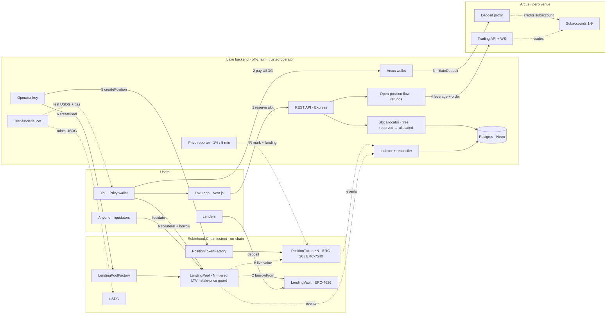

# Laxu

**Make your position capital efficient.**
Borrow against your open perp trades. Earn when others back them.

**Live app:** [App](https://laxu.vercel.app) · **Demo video:** [Demo](https://www.loom.com/share/9debdffa70c042d0a8f9f573f3c89843) · **Pitch deck:** [Pitch](https://pitch.com/v/laxu-bsyust) · **Litepaper:** [docs/LITEPAPER.md](docs/LITEPAPER.md)
**Network:** Monad testnet (chain ID) · **Built for:** Arbitrum Open House Singapore 2026

> ⚠️ Testnet only, no real funds. Laxu is an independent project built on Arcus,
> not affiliated with or endorsed by Arcus.

## TL;DR

- When you open a leveraged trade, your money is locked until you close it.
- Laxu turns each open trade into its own token (an ERC-20 / ERC-7540 on Robinhood Chain), and every token gets an isolated lending pool.
- Borrow USDG against your trade while it keeps running. Others can buy into your trade, and you earn 2% on each buy-in.

## Contents

1. [The problem, and who has it](#the-problem-and-who-has-it)
2. [The solution, and how it works](#the-solution-and-how-it-works)
3. [Try it yourself (for judges)](#try-it-yourself-for-judges)
4. [What works / what doesn't work yet](#what-works--what-doesnt-work-yet)
5. [Key decisions and tradeoffs](#key-decisions-and-tradeoffs)
6. [Code tour](#code-tour)
7. [Tests: the risky path](#tests-the-risky-path)
8. [Edge cases handled](#edge-cases-handled)
9. [Deployed contracts](#deployed-contracts)
10. [How Laxu uses Privy](#how-laxu-uses-privy)
11. [Built with / credits](#built-with--credits)
12. [How this was built](#how-this-was-built)
13. [Run it locally](#run-it-locally)
14. [Roadmap](#roadmap)
15. [Acknowledgments](#acknowledgments)

## The problem, and who has it

**Who:** traders on [Arcus](https://arcus.xyz), Robinhood Chain's perp venue, including its **stock perps** (TSLA, NVDA, SPY…).

**What they do today:** to get cash out of a winning trade, they **close it** (and lose the exposure) or pull margin out of it (and shrink the trade).

**Why existing tools don't cover it:**
- exchanges don't lend against open positions;
- lending markets accept deposits and LP tokens (e.g. GMX GM on Dolomite), not a trader's own position;
- leveraged tokens (e.g. Arcus pTokens) are the platform's fixed products, and they have no lending market yet.

## The solution, and how it works


### Flow 1: open a trade

1. **Reserve a slot.** The backend reserves one of its Arcus subaccounts for you.
2. **Pay USDG** from your Privy wallet to Laxu's Arcus wallet.
3. **Deposit.** The Arcus wallet calls `initiateDeposit` on Arcus's deposit proxy, into the reserved subaccount.
4. **Trade.** The backend sets leverage, places a market order, and waits for the fill.
5. **Mint.** The operator calls `PositionTokenFactory.createPosition`, which mints the position token to your wallet.
6. **Pool.** The operator calls `LendingPoolFactory.createPool`, which creates the token's isolated lending pool.

### Flow 2: borrow

- **A.** Deposit your position tokens into the pool as collateral.
- **B.** The pool prices them live from the token (`totalAssets` / `navPerShare`), which is updated by the price reporter.
- **C.** USDG is drawn from the shared `LendingVault` and sent to you.

Repay any time. If a loan becomes unhealthy, anyone can liquidate it.

### Keeping prices fresh

- **R.** The backend's price reporter writes the Arcus mark price and funding to each token (on a 1% move or every 5 minutes).
- Each token computes its own value on-chain from those inputs.
- Prices older than 7 minutes block new borrowing and collateral withdrawals (liquidation and repayment are never blocked; closed positions are exempt).

The backend also runs an **indexer + reconciler** (reads contract events, checks the ledger against Arcus, resumes interrupted jobs), keeps shared state in **Postgres (Neon)**, and serves the **test-funds faucet** (1,000 USDG plus gas, once per day).

### Also

- **Buy-ins:** once a creator lists a position, anyone can buy in. Buy-ins are proportional: size, entry and capital grow together, so value per token doesn't change and leverage stays the same (unless the proportional add is below Arcus's minimum order size, in which case the buy-in backs the position as margin only). The creator gets 2% of each non-creator buy-in, charged at request time and not refunded on cancel.
- **Redeem:** any holder can exit their slice. The backend reduces the Arcus position proportionally and pays out at NAV.
- **Close → settle → claim:** the creator requests a close (only while holding the full supply). The backend closes on Arcus, records the final mark on-chain, withdraws what Arcus returns, and settles with the amount actually recovered. Every holder then gets their pro-rata share (the backend pushes claims to EOA holders).
- **Stop-loss / take-profit:** per holder. A triggered level exits only that holder's wallet balance, not the whole position.

### Worked example

You open **200 USDG at 5×** → the 1–5× tier allows 50% LTV, so you can borrow up to **100 USDG** straight away.
If the position gains 50 USDG, it's worth 250, and your limit rises to **125** with no transaction from anyone.
If it falls, the limit falls too. Once your debt passes 60% of the collateral value (the 1–5× liquidation threshold), anyone can liquidate part of the loan.

<details>
<summary>Mermaid version of the diagram</summary>



</details>

## Try it yourself (for judges)

1. Open the [live app](https://laxu.vercel.app) and sign in with email or a wallet.
2. Click **Get test funds**. You receive 1,000 test USDG plus a gas top-up. *(Once per 24 hours.)*
3. Go to **Trade**, pick **ETH-USD**, long, **3×**, **50 USDG**, and click **Open**. Approve the USDG payment. *(Takes about 1–2 minutes: first the deposit is credited, then the order fills.)*
4. You land on your position page. The token is in your wallet and the lending pool shows as ready.
5. **Borrow:** deposit your tokens, then borrow half the maximum. The health factor appears, and your USDG balance goes up.
6. **Repay all**, then withdraw your collateral.
7. **Try a failure on purpose:** borrow more than the maximum. The app shows the contract's "exceeds LTV" reason instead of sending the transaction. *(If the last price report is more than 7 minutes old, you'll see "Prices updating, try again shortly." instead.)*

**One real example of each step on the explorer:**

| Step | Transaction |
|---|---|
| `createPosition` | [`0xc455f5ccc99a07a38481f944d0330dda0d330be23e56394ced3616a6603c374e`](https://explorer.testnet.chain.robinhood.com/tx/0xc455f5ccc99a07a38481f944d0330dda0d330be23e56394ced3616a6603c374e) |
| `createPool` | [`0xeaa4b2f2a927c00142bef2ad161eeb0b6eb239dda308ad8181cbb4494f1ffc8c`](https://explorer.testnet.chain.robinhood.com/tx/0xeaa4b2f2a927c00142bef2ad161eeb0b6eb239dda308ad8181cbb4494f1ffc8c) |
| `depositCollateral` | [`0xfc05328643ca1032dd2ea649c4781116148eaf3b8b416f88d778c0bee16380ae`](https://explorer.testnet.chain.robinhood.com/tx/0xfc05328643ca1032dd2ea649c4781116148eaf3b8b416f88d778c0bee16380ae) |
| `borrow` | [`0x88f292627ef809d54fad666c9fd79855865a611a8c63cce983115c5ebe3312a1`](https://explorer.testnet.chain.robinhood.com/tx/0x88f292627ef809d54fad666c9fd79855865a611a8c63cce983115c5ebe3312a1) |
| `repay` | [`0xc6030f2302afafc487e0a2ddfcdbcaede38595fa60fba810886ebe0c97519023`](https://explorer.testnet.chain.robinhood.com/tx/0xc6030f2302afafc487e0a2ddfcdbcaede38595fa60fba810886ebe0c97519023) |
| `list` | [`0xd872ed0b251dcef4b94e955a7341a2632da20b1b2e1891dfbc01276e47ac2ba8`](https://explorer.testnet.chain.robinhood.com/tx/0xd872ed0b251dcef4b94e955a7341a2632da20b1b2e1891dfbc01276e47ac2ba8) |
| `buy-in` | [`0xb563d81776770f7934240bd9d2e9be2473a2a61b3b608e3212ba563c69fd70b1`](https://explorer.testnet.chain.robinhood.com/tx/0xb563d81776770f7934240bd9d2e9be2473a2a61b3b608e3212ba563c69fd70b1) |

## What works / what doesn't work yet

### ✅ Works (a judge can run it)

- Sign-in with Privy (email or wallet, embedded wallet), user profile and username.
- Test-funds faucet: USDG plus a gas top-up, limited per wallet and per IP.
- Opening a real trade on Arcus testnet → a PositionToken minted to the user → its LendingPool created automatically.
- Automatic refunds when anything fails before the fill. The flow resumes after a backend restart.
- Deposit collateral / borrow / repay / withdraw collateral, with a live health factor.
- Price reporter (mark + funding; 1% deviation or 5-minute heartbeat). The token's value is computed on-chain from those inputs.
- Markets list with live Arcus data, logos and max leverage.
- Buy-in and redeem: contracts, backend fulfilment, and the position-page UI. ⚠ verify on testnet before submitting.
- Stop-loss / take-profit: contracts, the backend watcher (runs on the reporter tick) and the position-page panel. ⚠ verify a trigger actually fires on testnet before submitting.

### 🚧 Not yet / limited

- **Liquidation bot:** off by default (`ENABLE_LIQUIDATOR=false`). `liquidate()` is permissionless on-chain, so anyone can clear bad loans; the bot is a convenience. *Left off to save operator gas on testnet.*
- **Lending UI for the vault:** lenders can deposit into `LendingVault` (a standard ERC-4626) directly, but there is no screen for it yet. On testnet the deployer seeds the vault.
- **Selling a trade / secondary market:** not built. Tokens are standard ERC-20s, so it's possible later.
- **Community page:** shows sample data, not real positions, and is labelled "Preview, sample data" on screen.
- **Capacity:** one Arcus wallet → **up to 9 concurrent positions** (subaccounts 1–9, one per provisioned API key; index 0 receives swept balances). ⚠ state how many slots the deployed backend has provisioned. When all are busy, new opens are refused with a clear message. More keys or more wallets raise the cap.
- **Custody:** the Arcus leg is custodial (Laxu's wallet holds the Arcus accounts).
- **Prices:** reported by Laxu's backend, which is trusted. Mainnet plan: Chainlink CRE fetching Arcus's mark, plus a Chainlink price-feed sanity bound.
- **Interest:** a flat 10% APR, simple interest. Mainnet plan: a utilization-based rate with a protocol reserve share.
- **Bad debt** is not absorbed: if seized collateral can't cover a loan, the vault's books stay overstated by the shortfall. See [Contracts/README.md](Contracts/README.md#known-gaps).
- **Known bugs** (⚠ fill in from the final test run): the trade page's order book, tape and market-menu sparklines are simulated (the main chart and mark price are live Arcus data), and the positions dock's PnL ignores funding.

## Key decisions and tradeoffs

Each one is written as **decision → reason → what we gave up → removal path**.

1. **Wedge: borrowing against open trades, not copy trading.** Feedback from the Arbitrum feedback session steered us away from copy trading; borrowing against a live trade is the need nobody serves. *Gave up:* the social feed as the headline. *Path back:* buy-ins already let people back a trader, so a social layer can sit on top later.
2. **A token, not a platform loan (why on-chain).** A platform-only loan would make Laxu a bank: our money, our database, trust us. A token puts the collateral on-chain, so anyone can lend (the vault), anyone can liquidate, the rules are code, and backers can borrow against their slice. *Gave up:* simplicity, since every open now has an off-chain leg and an on-chain leg that must agree. *Mitigation:* the resumable open flow and the reconciler.
3. **Robinhood Chain + Arbitrum.** Stock perps on Arcus make "a leveraged TSLA trade as collateral" possible. Arbitrum Orbit gas makes per-minute price reports affordable. It sits in the same ecosystem as USDG. *Gave up:* reach on other venues. *Path:* the token and pool contracts don't depend on Arcus; only the backend adapter does.
4. **One isolated pool per position, sharing one vault.** Bad debt can't spread between positions, and lenders still get one place to deposit. The same pattern as isolated markets (e.g. Dolomite's isolation mode for GMX GM). *Gave up:* cross-collateral borrowing. *Cap:* each pool has its own debt ceiling at the vault.
5. **LTV tiers by leverage (50 / 40 / 25%).** A leveraged position's value moves faster, so higher leverage can borrow less. The tier is fixed from the token's leverage when the pool is created, so no caller can choose a pool's risk numbers. *Gave up:* capital efficiency at high leverage. *Path:* the numbers are a starting point, not back-tested.
6. **The stale-price guard blocks borrowing, not liquidation.** New risk needs fresh prices, but clearing bad debt on last-known prices beats not clearing it. A closed position is exempt, since reports stop at close.
7. **Proportional buy-ins and redeems.** Everyone's leverage and value per token stay identical. *Gave up:* changing leverage after tokenizing.
8. **We dropped Chainlink CRE for testnet.** It cost about $600 and access is gated. We replaced it with a backend reporter, bounded by contract rules: it supplies Arcus data (mark, funding, fills, the settlement amount) but can't set a share price directly, exit a holder whose own trigger isn't hit, take pending buy-ins or unclaimed settlement funds, or pay a claim to anyone but the holder, and reports must be newer than the last one. It is still trusted to report those numbers honestly. *Removal path:* CRE plus a price-feed bound on mainnet.
9. **What we cut, and why.** The liquidation bot (left off), the vault-lending screen, the secondary market, and a real community feed. All were dropped to ship one flow that works end to end: open → borrow.

## Code tour

| File | What it does | Why it's shaped that way |
|---|---|---|
| [PositionToken.sol](Contracts/contracts/PositionToken.sol) | NAV, proportional buy-in/redeem, close/settle/claim, per-holder triggers | One token per trade, so a trade can be held, lent against and shared like any ERC-20 |
| [LendingPool.sol](Contracts/contracts/LendingPool.sol) | Leverage tiers, `freshOracle`, health factor, liquidation close factor | Collateral is priced live from the token, so headroom moves with the trade |
| [LendingVault.sol](Contracts/contracts/LendingVault.sol) | ERC-4626 shared liquidity, per-pool debt ceilings | Liquidity is shared, risk is isolated |
| [PositionTokenFactory.sol](Contracts/contracts/PositionTokenFactory.sol), [LendingPoolFactory.sol](Contracts/contracts/LendingPoolFactory.sol) | EIP-1167 clones, roles | Token creation is operator-only (it needs a real fill); pool creation is permissionless (risk is derived, not chosen) |
| [openPosition.ts](Backend/src/services/openPosition.ts) | The resumable open-position state machine, with refunds | Every step saves what it learned before moving on, so a restart resumes instead of moving money twice |
| [allocator.ts](Backend/src/services/allocator.ts) | The slot pool (free → reserved → allocated), expiry sweep | One Arcus API key binds to one subaccount, so subaccounts are reused as slots |
| [reporter.ts](Backend/src/services/reporter.ts) | The deviation/heartbeat reporting policy | 1% / 5 min keeps reports inside the pool's 7-minute freshness window |
| [signing.ts](Backend/src/arcus/signing.ts) | Arcus Ed25519 order signing | Orders are signed per subaccount with that slot's API key |

**1. The whole valuation in three lines** ([PositionToken.sol](Contracts/contracts/PositionToken.sol#L371-L375)). Capital, plus PnL at the reported mark, plus funding not yet paid out to redeemers. Buy-ins and redeems change size, entry and capital but leave value per token unchanged, which is why the reporter can't set share prices directly.

```solidity
function _computeValue(uint256 mark, int256 funding) internal view returns (int256) {
    int256 pnl = (int256(size) * (int256(mark) - int256(entryPrice))) / int256(PRICE_SCALE);
    if (direction == Direction.Short) pnl = -pnl;
    return int256(capital) + pnl + (funding - fundingSettled);
}
```

**2. The stale-price guard** ([LendingPool.sol](Contracts/contracts/LendingPool.sol#L215-L222)). Applied only to `borrow()` and `withdrawCollateral()`, the two actions that add risk. `liquidate()` is deliberately left unguarded: blocking liquidation during a staleness window lets bad debt grow while nobody can act.

```solidity
modifier freshOracle() {
    IPositionToken t = IPositionToken(collateralToken);
    require(
        t.closed() || block.timestamp - t.lastReportTimestamp() <= MAX_REPORT_AGE,
        "LendingPool: stale oracle data"
    );
    _;
}
```

**3. The risk tiers** ([LendingPool.sol](Contracts/contracts/LendingPool.sol#L492-L499)). LTV / liquidation threshold / liquidation bonus, in basis points. Resolved once in `initialize()` from the token's fixed leverage. (The last branch's comment is shortened here.) Leverage above 20× falls through to the last tier: the backend caps leverage at 20×, but the contracts don't enforce it (see [known gap 2](Contracts/README.md#known-gaps)).

```solidity
function _riskTierFor(uint256 leverage) internal pure returns (RiskTier memory) {
    if (leverage <= 5) return RiskTier(5_000, 6_000, 800); // 1-5x:   50% / 60% / 8%
    if (leverage <= 10) return RiskTier(4_000, 5_000, 1_000); // 6-10x:  40% / 50% / 10%
    // 11-20x: 25% / 35% / 12%. ...
    return RiskTier(2_500, 3_500, 1_200);
}
```

More detail on the lending design and its known gaps: [Contracts/README.md](Contracts/README.md).

## Tests: the risky path

```bash
cd Contracts && npm install && npx hardhat test
cd Backend && npm install && npm test
```

- **Contracts:** 114 tests: `PositionToken` 76, lending 38.
- **Backend:** 90 unit tests across units, sizing, triggerMath, settlement, faucetRules, openPosition, signing, arcusStream, markets and others.

The tests that back the claims above:

| Claim | Test |
|---|---|
| Buy-ins don't dilute | *a buy-in at NAV 1.48 leaves NAV at 1.48 and grows size, entry and capital* |
| Redeems are proportional | *redeeming 50% pays 50% of totalAssets, halves capital and effective funding, and keeps NAV* |
| Borrow limit follows the trade | *hands the borrower more headroom automatically when the position gains value* |
| Liquidation math | *liquidates at 50% close factor and pays the 8% bonus in shares* |
| Deep trouble clears fully | *raises the close factor to 100% once the health factor falls below 0.95* |
| Stale prices block borrowing | *blocks borrow() once the collateral's last report is older than MAX_REPORT_AGE* |
| …but not liquidation | *does NOT block liquidate() on stale data -- liquidating on last-known data beats not liquidating at all* |
| Creator fee | *sends exactly 2% of a non-creator buy-in to the creator and queues the net amount* |
| Settlement is fair | *pays 1,000 USDG out 500/300/200 and keeps totalAssets/totalSupply constant between claims* |
| Triggers don't touch collateral | *only exits the wallet balance, not tokens posted as LendingPool collateral* |
| Can't close from under a loan | *blocks the creator's requestClose while their shares are posted as collateral* |

## Edge cases handled

| Case | What happens | Where |
|---|---|---|
| Zero amounts | Rejected | `LendingPool` (`zero amount` / `zero shares`) |
| No free slot | "All trading slots are busy right now. Try again in a few minutes." No USDG is taken, because the slot is reserved before you pay | [allocator.ts](Backend/src/services/allocator.ts) |
| Payment from the wrong sender, to the wrong wallet, or reverted | Not accepted; the hash is cleared and the request keeps waiting for a correct payment until the reservation expires | `confirmPayment` in [openPosition.ts](Backend/src/services/openPosition.ts) |
| Payment of the wrong amount | Recorded and refunded | `confirmPayment` |
| Reservation expires before payment | The slot is freed; a late payment is refunded | [allocator.ts](Backend/src/services/allocator.ts), `resumeOpenRequests` |
| Any failure before the fill | Automatic refund (through an Arcus withdrawal if the money was already deposited) | [openPosition.ts](Backend/src/services/openPosition.ts) |
| Backend restart mid-open | The request resumes where it stopped | `resumeOpenRequests` |
| Database drops right after the deposit is sent | The next attempt sees the Arcus credit (or that the payment has left the wallet) and waits for the credit instead of depositing twice. ⚠ verify | `depositPayment` |
| Stale prices | Borrow and withdraw are blocked ("Prices updating, try again shortly."); liquidation stays possible | `freshOracle` |
| Borrowing above LTV | Reverts; the UI shows the reason before any wallet prompt | `LendingPool.borrow`, [actions.ts](App/src/lib/actions.ts) |
| Withdrawing collateral that would make the loan unhealthy | Blocked | `LendingPool.withdrawCollateral` |
| Double-clicked faucet claim | Paid once (advisory locks on user and IP) | [faucet.ts](Backend/src/services/faucet.ts) |
| Creator closes while their tokens are posted as collateral | Blocked: the creator must hold the full supply | `PositionToken.requestClose` |

**Not handled yet:** an Arcus outage mid-trade beyond the timeouts (needs manual resolution); more than 9 concurrent positions per Arcus wallet; partial fills. ⚠ verify.

## Deployed contracts

Robinhood Chain testnet, chain ID 46630. Explorer: https://explorer.testnet.chain.robinhood.com

| Contract | Address | Explorer | Purpose | Verified |
|---|---|---|---|---|
| PositionToken (implementation) | `0x60101F14631bAAff60f09D5BA0aDF3F940d15e2a` | [View](https://explorer.testnet.chain.robinhood.com/address/0x60101F14631bAAff60f09D5BA0aDF3F940d15e2a) | Logic cloned per trade | ✓ |
| PositionTokenFactory | `0x15F8DFF61656e17a5C5AE7e03571f9833bBEb84c` | [View](https://explorer.testnet.chain.robinhood.com/address/0x15F8DFF61656e17a5C5AE7e03571f9833bBEb84c) | Creates one token per trade (operator only) | ✓ |
| PositionToken (example) | `0xC92426b477Fa3ffeFe3Fcb4a05c8fB8ca41A9519` | [View](https://explorer.testnet.chain.robinhood.com/token/0xC92426b477Fa3ffeFe3Fcb4a05c8fB8ca41A9519) | A live position token minted by the factory | n/a |
| LendingVault | `0x6Defff9515D183AB7bBd3BBcE822C54D852D4bEf` | [View](https://explorer.testnet.chain.robinhood.com/address/0x6Defff9515D183AB7bBd3BBcE822C54D852D4bEf) | Shared USDG liquidity (ERC-4626) | ✓ |
| LendingPool (implementation) | `0x8b8d3EeE0BF4f42417C2b4d14491D343F162Bd1C` | [View](https://explorer.testnet.chain.robinhood.com/address/0x8b8d3EeE0BF4f42417C2b4d14491D343F162Bd1C) | Logic cloned per position | ✓ |
| LendingPoolFactory | `0x6DDb43385fbB07a5c9ee2b84343940eE84f138ab` | [View](https://explorer.testnet.chain.robinhood.com/address/0x6DDb43385fbB07a5c9ee2b84343940eE84f138ab) | Creates isolated pools (permissionless) | ✓ |
| USDG (Arcus testnet) | `0x293b337712d4312776a3a2d292f44410e7873bad` | [View](https://explorer.testnet.chain.robinhood.com/address/0x293b337712d4312776a3a2d292f44410e7873bad) | Stablecoin | n/a |

Full deployment record: [Contracts/deployments/robinhoodTestnet.json](Contracts/deployments/robinhoodTestnet.json).

## How Laxu uses Privy

Privy handles sign-in and embedded wallets, and the backend verifies every request's Privy token and reads the user's wallet from Privy, never from the request. Beyond login, **loan protection** lets a borrower allow Laxu to repay their loan from their own wallet when its health factor drops:

- The user adds Laxu as a **Privy signer** on their embedded wallet, restricted by a **Privy policy** to `repay` on that one pool, up to a per-call cap, with no native value. Privy enforces it: other calls (a `transfer`, another pool, a bigger amount) are refused by the policy.
- The user also approves an ERC-20 allowance equal to their spend limit, so the allowance caps the total. A backend worker watches the health factor and repays through Privy.
- Status: the signer and policy behaviour is measured on Monad testnet; the full end-to-end loan run is not yet recorded, and Part 3 (Privy server wallets for the faucet and liquidator) is not built. Details, the exact policy, limits and evidence: [docs/privy-integration.md](docs/privy-integration.md) and [docs/privy-findings.md](docs/privy-findings.md).

## Built with / credits

| Layer | Technology |
|---|---|
| Contracts | Solidity 0.8.27, Hardhat, OpenZeppelin Contracts |
| Backend | Node.js, Express, TypeScript, Prisma, Neon Postgres, viem |
| Frontend | Next.js, React, Privy, viem, TradingView Lightweight Charts |
| Venue | Arcus testnet API, WebSocket and deposit proxy |
| Chain | Robinhood Chain testnet (Arbitrum Orbit) |

**What we started from:**

- **[OpenZeppelin Contracts](https://github.com/OpenZeppelin/openzeppelin-contracts):** ERC-20, ERC-4626, Clones, SafeERC20, access control.
- **[OpenZeppelin community contracts](https://github.com/OpenZeppelin/openzeppelin-community-contracts):** `ERC7540`, `ERC7540AdminDeposit` and `ERC7540AdminRedeem`, **vendored into [Contracts/contracts/vendor/](Contracts/contracts/vendor/) and modified**. `_deposits`, `_redeems`, `_totalPendingDepositAssets` and `_totalPendingRedeemShares` were changed from `private` to `internal`, so `PositionToken` can settle automatically on fulfil. Each file's header records the change and the hash of the unmodified upstream file.
- **[TradingView Lightweight Charts](https://github.com/tradingview/lightweight-charts)** (Apache 2.0). Charts show the TradingView logo, and the footer and chart pages link to TradingView, as the license requires.
- **Arcus** testnet API, WebSocket and deposit proxy; **Privy** for auth and embedded wallets.

Everything else (the position token, the lending contracts, the backend and the frontend) was written for Laxu.

## How this was built

Laxu was built by one developer with an AI coding assistant (Claude Code). The product decisions, architecture, risk parameters and tradeoffs above were ours. All generated code was reviewed, tested and changed where it was wrong for our case. For example, the stale-price guard originally applied to closed positions too; since reports stop at close, borrowers could never have withdrawn their collateral to claim. We added the closed-position exemption and a test for it.

## Run it locally

**Prerequisites:** Node 20+, a Postgres URL (e.g. Neon), a Robinhood Chain testnet RPC URL (with WebSocket support for the indexer), and a Privy app.

### Contracts

```bash
cd Contracts
npm install
cp .env.example .env        # fill in the values below
npx hardhat compile
npx hardhat test
npx hardhat run scripts/deploy.js --network robinhoodTestnet
```

Addresses are written to `deployments/robinhoodTestnet.json`.

| Variable | Purpose |
|---|---|
| `RPC_URL` | Robinhood Chain testnet RPC |
| `ADMIN_PRIVATE_KEY` | Deployer and owner |
| `OPERATOR_ADDRESS` | The backend operator's address (becomes each token's `arcusOperator`) |
| `USDG_ADDRESS` | `0x293b337712d4312776a3a2d292f44410e7873bad` |
| `DEFAULT_DEBT_CEILING` | Per-pool debt ceiling at the vault (USDG base units) |
| `SEED_VAULT_AMOUNT` | Optional: USDG the deployer seeds into the vault |

### Backend

```bash
cd Backend
npm install
cp .env.example .env        # every variable is documented in the file
npm run db:migrate
npm run db:seed
npm run slots:provision     # registers the Arcus subaccount slots
npm run smoke -- keys       # checks every slot's key signs for its subaccount
npm run dev                 # API on :4000
```

[Backend/.env.example](Backend/.env.example) documents every variable. The groups:

| Group | Main variables | Purpose |
|---|---|---|
| Chain | `RPC_URL`, `CHAIN_ID`, `USDG_ADDRESS` | Robinhood Chain testnet access |
| Contracts | `POSITION_TOKEN_FACTORY_ADDRESS`, `LENDING_POOL_FACTORY_ADDRESS`, `*_DEPLOY_BLOCK`, `OPERATOR_PRIVATE_KEY`, `LIQUIDATOR_PRIVATE_KEY` | Addresses from the deployment, and the keys that write to them |
| Arcus | `ARCUS_API_BASE_URL`, `ARCUS_WS_URL`, `ARCUS_DEPOSIT_PROXY`, `ARCUS_BRIDGE_VAULT_ADDRESS`, `ARCUS_SLIPPAGE_BPS` | The venue |
| Slots | `SECRET_OPERATOR_A_EVM`, `SECRET_OPERATOR_A_EVM_SLOT_n`, `ARCUS_API_KEY_n`, `ARCUS_OPERATOR_ADDRESS` | The Arcus wallet and one API key per subaccount |
| Workers | `ENABLE_INDEXER`, `ENABLE_RECONCILER`, `ENABLE_REPORTER`, `ENABLE_LIQUIDATOR` | Background jobs (all off by default) |
| Faucet | `FAUCET_ENABLED`, `FAUCET_PRIVATE_KEY`, `FAUCET_USDG_AMOUNT`, `FAUCET_COOLDOWN_HOURS` | Test funds |
| Privy | `PRIVY_APP_ID`, `PRIVY_APP_SECRET` | Verifies users' access tokens |

**Secret naming rules.** Every `*_ref` column in the database names a secret, which resolves to `SECRET_<REF_UPPERCASED>`.
- `SECRET_OPERATOR_A_EVM` is the Arcus wallet's EVM private key.
- `SECRET_OPERATOR_A_EVM_SLOT_n` is the **Arcus API signing key** (Ed25519) for subaccount `n`. Despite the name, it is not an EVM key.
- `ARCUS_API_KEY_n` is that key's public half; `slots:provision` checks the two match.

### Frontend

```bash
cd App
npm install
cp .env.example .env.local
npm run dev                 # http://localhost:3000
```

| Variable | Purpose |
|---|---|
| `NEXT_PUBLIC_PRIVY_APP_ID` | Privy app ID |
| `NEXT_PUBLIC_CHAIN_ID`, `NEXT_PUBLIC_RPC_URL`, `NEXT_PUBLIC_RPC_WS_URL` | Robinhood Chain testnet |
| `NEXT_PUBLIC_EXPLORER_URL` | `https://explorer.testnet.chain.robinhood.com` |
| `NEXT_PUBLIC_USDG_ADDRESS` | Must match the backend's `USDG_ADDRESS` |
| `NEXT_PUBLIC_API_URL` | Backend URL (default `http://localhost:4000`) |
| `NEXT_PUBLIC_ARCUS_API_URL`, `NEXT_PUBLIC_ARCUS_WS_URL`, `NEXT_PUBLIC_ARCUS_BRANDING_URL` | Public Arcus market data and logos |
| `NEXT_PUBLIC_ETH_FAUCET_URL` | Optional public ETH faucet link |

## Roadmap

1. **Mainnet price safety:** Chainlink CRE reporting Arcus's mark, bounded by a Chainlink price feed.
2. **Less custody:** per-user or contract-owned Arcus accounts, keeper incentives and an insurance fund.
3. **Lending for Arcus pTokens.**
4. **A secondary market and a social layer** on top of buy-ins.
5. **More venues:** Hyperliquid, Monad.

## Acknowledgments

Arbitrum Open House Singapore, Robinhood Chain, and the Arcus testnet.

## License

[MIT](LICENSE)
